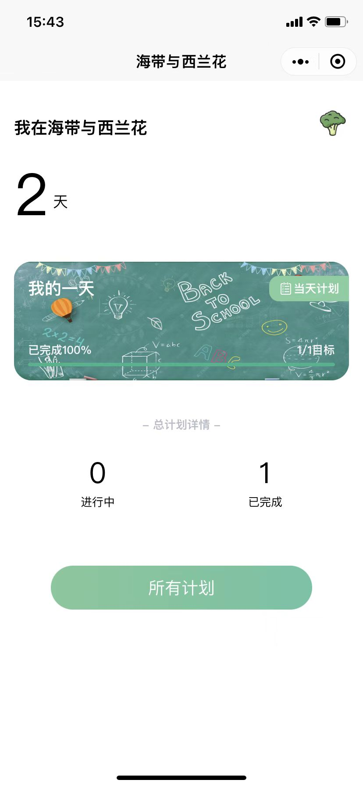
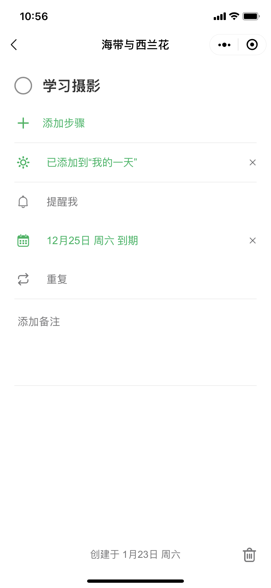

<h1 align="center">Kelp and Broccoli</h1>

[海带与西蓝花](https://github.com/cleves0315/kelp-and-broccoli) uni-app 版

## 介绍

海带与西兰花是一款计划管理工具，方便你的日常管理。

## 功能

- 添加计划，输入计划名称
- 方便快速设定截止日期与重复周期
- 支持定时推送消息
- 计划类型分类（”我的一天“ 为当天主要任务）

## 预览

